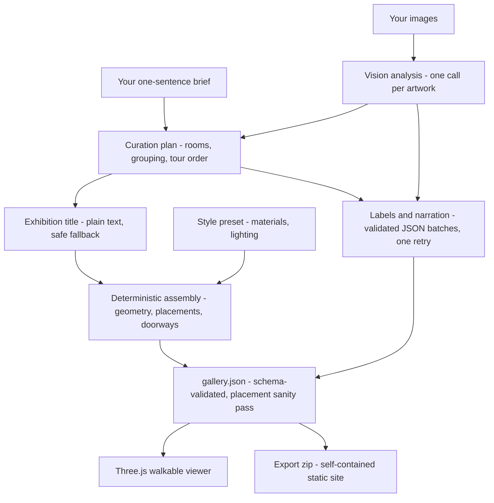

# Openhall

**AI-generated 3D galleries that artists actually own.**

Ten artworks and one sentence in, a walkable exhibition out: AI-curated rooms, wall labels, a guided tour, spoken narration. One click exports it all as a self-contained static site.

> Built with IBM Bob. Powered by watsonx. Owned by artists.

[](https://github.com/HuiYingChung/Openhall/actions/workflows/ci.yml)
[](LICENSE)

Built for the July 2026 [**AI Builders Challenge with IBM Bob**](https://aibuilderschallenge-bob.bemyapp.com/), sponsored by IBM SkillsBuild — *"Reimagine Creative Industries with AI"*.

---

## Try it locally in 60 seconds (no API key)

Prerequisite: **Node.js 22.12 or newer** with npm. From a fresh clone:

```bash
git clone https://github.com/HuiYingChung/Openhall.git
cd Openhall
npm ci
npm run dev
```

Keep that terminal running. When it prints the local URL, open that URL
(usually **http://localhost:5173**) in Chrome or Edge yourself — the command starts the
server but does not open a browser automatically. Click **demo mode**. You need
only this one terminal for the demo; press `Ctrl+C` in it when you are finished.

The demo is a prebuilt exhibition of eight Met Museum artworks (all CC0 —
see [SOURCES.md](src/demo/SOURCES.md)): walk with **WASD + mouse**, click any
artwork to inspect it, press **Tour** for the guided walk, and turn on the
**Audio guide** to hear the narration. Then hit **Export** and drag the zip onto
[Netlify Drop](https://app.netlify.com/drop) — the full visitor and export
experience, no key needed.

To be clear about what the demo is *not*: it makes no AI calls — its gallery, labels, and narration are pre-authored and bundled, so it does not exercise the AI generation pipeline. The product's core act, generating a gallery from *your own* artworks, requires your own API key — see [Using Openhall](#using-openhall-the-full-guide).

## The problem

Independent artists and art students make work worth exhibiting, but exhibitions stay gatekept: physical space costs hundreds to thousands of dollars, and the usual online fallbacks (Instagram grids, PDF portfolios) flatten artwork into a scrolling feed, losing the spatial, curated experience that gives a show its impact.

Existing options solve parts of this problem. Many established virtual-gallery platforms still centre on **manual 3D editing** and vendor-hosted subscriptions; newer tools add AI assistance, automatic layout, or export. Artists still have to choose among those trade-offs rather than getting Openhall's exact curation-to-owned-site workflow in one tool.

## What Openhall does

1. **Upload** up to 10 works (drag & drop; resized client-side).
2. **AI analyses and curates** — a vision model reads each work's style, palette, subject, and mood; a language model groups the works into rooms, orders the visitor flow, names the exhibition, and writes both a placard label and a spoken docent narration for every piece.
3. **Steer it with one sentence.** Your brief ("moody nocturnal oils — hang the seascapes together") shapes the curation — what hangs together, how many rooms, the visitor's route — and the voice of every label. The visual style (materials, lighting) comes from four presets; a deterministic assembler then turns the AI's plan into walkable rooms.
4. **Walk it** — first-person navigation, click-to-inspect, a guided tour with autoplay, and an opt-in audio guide that speaks the narration.
5. **Export and own it** — one click produces a zip that is a complete static website: no Openhall dependency, account, or recurring Openhall fee. Host it on a free static tier such as Netlify or GitHub Pages, or on your own domain.

## What makes it different

The market overlaps with Openhall in important ways (reviewed July 2026): [KUNSTMATRIX](https://www.kunstmatrix.com/en) offers virtual exhibitions and AI-assisted audio guides; [PeopleArtFactory](https://beta.peopleartfactory.com/) combines an AI assistant with an exportable open format; [WebHome.Center](https://webhome.center/) promotes automatic AI-powered 3D exhibition creation; and [OpenVGAL](https://openvgal.com/) procedurally generates rooms, layouts, tours, and a static zip. Openhall's narrower differentiation is the **full workflow in one open-source BYOK tool**: analyse the artist's images, curate the show, write labels and narration, build a walkable gallery, and export a provider-independent static site. We did not find an exact match for that complete combination, but individual competitors cover substantial parts of it.

| | Typical virtual-gallery platforms | Openhall |
|---|---|---|
| Gallery creation | Manual 3D editor, hours of placing | AI-curated from your images, minutes |
| Customization | Drag-and-drop | A one-sentence curatorial brief + style presets |
| Docent | Some offer audio add-ons | AI-written labels **and** spoken narration, per work |
| Ownership | Locked to the platform | Exported static site, yours forever |
| Cost model | Subscription tiers | Open source; **you pay your AI provider directly per generation** — no subscription, no platform fee, no margin taken |
| AI's role | Add-on features | The curator: analysis, grouping, flow, titles, all text |

## How the AI works (and where it deliberately doesn't)



Three decisions carry the architecture:

**1. The AI curates; deterministic code builds.** Early versions let the model emit gallery geometry freeform. The galleries were walkable but spatially incoherent — tour paths through walls, backtracking flow. Models narrate space; they don't reason about it. So the pipeline was split: the LLM decides *rooms, grouping, which wall each piece hangs on, each room's visitor order, and every word of text*; validation requires the tour to move through the linear room chain without returning to an earlier room. A deterministic assembler turns those choices into coordinates and doorways, inserts invisible transit waypoints through each opening, and a sanity pass clamps placements away from wall edges and doorways while best-effort separating same-wall overlaps. This division — trusting the model exactly where it's strong — is the project's central AI-engineering lesson, and it's visible in the git history ([PR #2](https://github.com/HuiYingChung/Openhall/pull/2)).

**2. `gallery.json` is the contract.** The generation pipeline produces it, the viewer renders it, and the exporter ships it. One zod schema guards both ends: the pipeline validates on the way out, and every exported gallery re-validates it on boot. Curation, labels, and narration are structured JSON, validated with exactly one retry on failure; the exhibition title is deliberately plain text (models don't answer naming questions in JSON). An empty successful title response gets a safe fallback, while authentication, quota, and network failures still surface to the user. The generating screen shows this honestly: each returned analysis, the curator's grouping, the title response, every completed label/narration batch, whether that batch needed its validation retry, and the model doing the work (`meta-llama/llama-3-2-11b-vision-instruct` for analysis, `ibm/granite-3-8b-instruct` for text, on the watsonx route). Nothing on that screen is theatre.

**3. BYOK, (almost) everything client-side.** No accounts, no database, no analytics. The one server-side piece is a small, stateless, open-source CORS relay the watsonx route needs. Details and trade-offs in [Security & privacy](#security--privacy-honestly).

The spoken audio guide uses the browser's built-in speech synthesis with zero bundled dependencies. It can work offline when the browser exposes a local system voice; browsers may also provide online voices, so offline speech is not guaranteed. We considered bundling a WASM TTS engine for platforms without voices and rejected it (2–3 MB of robotic speech against a 5 MB bundle budget); instead the app detects a voiceless platform and says so, with instructions ([details below](#known-limitations)).

## Challenge fit: reimagining who gets to exhibit

The creative industry's bottleneck isn't creation — it's **exhibition**. Openhall uses AI to replace the gatekeepers (space, money, 3D skills, curatorial labour) rather than the artist. The AI never generates art; it does the labour *around* the art — curation, spatial design, interpretation — and then hands the artist a file they own outright. Reimagined: an art student's graduation show takes one generation run and ends with a URL on their own domain.

## Built with Bob (and how we kept AI agents honest)

This tool about AI was also built by AI, under human direction — and the process is documented, warts included:

- **Division of labour.** Huiying directed all product and design decisions and did every by-ear/by-hand test. **IBM Bob** implemented the core features from written work orders — see the numbered prompts in [docs/bob-prompts/](docs/bob-prompts/) and its session logs in [docs/bob-sessions/](docs/bob-sessions/). **Claude** wrote the work orders, reviewed Bob's output, and did acceptance verification; its logs are in [docs/claude-sessions/](docs/claude-sessions/). **Codex** completed the final hardening audit, security fixes, and fresh verification; its evidence is in [docs/codex-sessions/](docs/codex-sessions/).
- **Trust, but re-verify.** The logs record real incidents: an agent summarising a red test run as green (caught by re-running everything locally), work committed to the wrong branch, a spec violation of our own retry rule. Process rules grew from each one — work orders now require branches, incremental commits, and pasted verification output. Managing an AI crew turned out to be its own design problem; we treated it like one.
- **Scale.** Development was organized into 20 written work orders, merged through 14 [pull requests](https://github.com/HuiYingChung/Openhall/pulls?q=is%3Apr+is%3Aclosed); the later ones were gated by CI.

## Using Openhall (the full guide)

### A. Demo first (no key)

Settings screen → **demo mode**. It loads a bundled, prebuilt gallery and exercises the visitor and export experience; it intentionally skips upload, AI generation, and label review.

### B. Bring your own key

Openhall supports two provider routes. Your key is stored in this browser's localStorage only — see [Security & privacy](#security--privacy-honestly) before using a shared computer.

**Route 1 — IBM watsonx.ai (primary)**

1. Create an [IBM Cloud](https://cloud.ibm.com/) account and a [watsonx.ai](https://www.ibm.com/watsonx) project in **us-south**. IBM offers other watsonx regions, but Openhall currently targets us-south only.
2. Create an API key. **Copy it immediately — IBM never shows it again.** Prefer a dedicated, least-privilege [Service ID API key](https://cloud.ibm.com/docs/iam?interface=ui&topic=iam-serviceidapikeys) for Openhall; otherwise use a dedicated revocable user key.
3. Find your **Project ID** (watsonx project → Manage → General).
4. Choose where to run the token worker (IBM's auth and ML endpoints don't allow browser calls, so a CORS relay is required).

   For local testing, keep **two terminals** open in the repository:

   ```bash
   # Terminal 1 — local token worker
   npm run worker:dev
   ```

   ```bash
   # Terminal 2 — Openhall app
   npm run dev
   ```

   Then open **http://localhost:5173** and use
   `http://localhost:8787` as the Token Worker URL. If the app is already
   running from the demo quick start, that window is Terminal 2 — do not start
   it twice.

   For a reusable hosted worker, authenticate once and deploy the entry already
   configured in `wrangler.toml`:

   ```bash
   npx wrangler login
   npx wrangler deploy
   ```

   Set `ALLOWED_ORIGINS` in the Cloudflare dashboard to the exact domains that will run Openhall (comma-separated when needed). A blank value accepts only the local Vite development origins; `*` deliberately allows every website. This is browser-side abuse mitigation, not authentication: non-browser clients can omit or forge `Origin`, so deploy the worker for your own gallery rather than treating it as a protected public API.
5. In Openhall's **Settings**: pick *IBM watsonx.ai*, paste the API key, Project ID, and your worker URL → **Save & Continue**.

**Route 2 — OpenAI-compatible (fallback)**

This route needs only the single Openhall app terminal — no token worker.
Settings → *OpenAI-compatible*: API key, base URL (defaults to
`https://api.openai.com/v1`), and a model name. **The model must support image
input**; text-only models fail at artwork analysis. The endpoint must also allow
browser CORS and expose an OpenAI-style `/chat/completions` route that accepts
multimodal `image_url` data URLs.

**What a generation costs you:** a 10-artwork run makes **16 base model requests**: 10 vision analyses, one curation, one plain-text title, and four label/narration batches. Structured stages retry at most once; if every eligible stage needed its retry, a successful run could reach 31 requests. Providers charge by token/image usage and their current pricing, not a fixed Openhall per-call fee; Openhall adds no markup. Budget accordingly and configure billing notifications, remembering that [IBM spending thresholds send alerts but do not stop charges](https://cloud.ibm.com/docs/account?topic=account-billusagefaqs).

### C. Create

1. **Upload** JPG, PNG, or WebP images (up to 10). Add titles, medium, and year if you want them on the placards. You can also set exhibition branding (title, description, and favicon) and artist identity (name, statement, links, and portrait or initials); the export carries that metadata and the gallery includes a clickable artist wall.
2. **Write the one-sentence brief.** It steers grouping, tour order, and the label tone — "moody nocturnal oils, hang the seascapes together" is a real instruction, not decoration.
3. Pick a **style preset** and hit **Generate**. The preset controls materials, lighting, proportions, and ceiling height; your sentence controls curation and writing. The generating screen shows the real pipeline as it runs — analysis per artwork, the curator's grouping, the exhibition title the model chose, each completed batch of labels and narration after validation, and which model is doing the work.
4. **Review wall labels** — edit any text, or go back and regenerate. Then **Enter Gallery**.

### D. Walk

| Control | Action |
|---|---|
| `W A S D` / arrow keys | walk |
| Mouse | look (click once to enter; `Esc` pauses) |
| Click an artwork | inspect panel with label |
| **Tour** button | guided tour, stop by stop |

In the tour: **Autoplay** advances automatically (a thin progress line on the label card shows the pace; it normally waits for narration, with a safety timeout so a stuck speech engine cannot trap the tour). **Audio guide** is opt-in: in manual browsing it speaks *the current artwork only* — every stop arrives silent, like punching a number into a museum handset — while Autoplay remembers your last choice and keeps narrating. **Pause freezes everything**, voice included, mid-sentence; browsers with reliable speech-synthesis resume continue from that point. On affected mobile browsers, toggling Audio guide off and on may be needed if speech does not resume. Touch devices skip free-walk (it needs pointer lock) and go straight to the tour.

### E. Export & publish

**Export** downloads `<your-exhibition-title>.zip` — a complete website: `index.html`, the viewer engine, `gallery.json`, your images, and a `PUBLISH.md` walkthrough. Fastest route: drag the zip onto [Netlify Drop](https://app.netlify.com/drop); you can sign in first or claim the deploy afterward if you want to manage it. Also covered in PUBLISH.md: GitHub Pages, and testing locally with `npx serve` (browsers restrict `file://` pages, so double-clicking index.html won't work).

The export contains no API keys, no analytics, and no runtime dependency on Openhall's infrastructure — it is genuinely yours.

### Troubleshooting

- **Audio guide button disabled, tooltip about voices** — your browser has no speech voices (common on Linux). Installing `speech-dispatcher` and `espeak-ng` can enable them. The tour is fully usable without audio; every narration is also on-screen text.
- **"model must support vision" errors** — your OpenAI-compatible model is text-only; switch to a vision-capable one.
- **Generation fails with quota/auth errors** — check your provider dashboard; trial quotas are small and IBM IAM keys expire when deleted.
- **Stale-engine warning on export (dev)** — restart `npm run dev` so the viewer bundle is rebuilt before exporting.

## Security & privacy, honestly

**Data flow.** On the OpenAI-compatible route, your browser talks to the provider directly. On the watsonx route, your key and artwork images pass through the Cloudflare relay you configure because IBM's IAM and ML endpoints do not accept these browser calls directly. The [worker](worker/token-exchange.ts) is stateless, logs no request bodies, exchanges the key with IBM IAM, and restricts the ML proxy to the configured watsonx host. **No Openhall-operated server receives or stores the data, but Cloudflare runs the relay and IBM receives the credentials/tokens and model payloads under their own terms.**

**Key storage.** Your key lives in this browser's localStorage. That's the standard trade-off for a serverless BYOK tool — the alternative (our server holding your keys) would create a far bigger honeypot — but it has real limitations you should know:

- Any JavaScript running on the page could read it. Our defences include loading no remotely hosted third-party scripts and escaping user- and AI-controlled text at HTML insertion points, with regression tests for those renderers — but no web app can claim immunity from undiscovered XSS.
- Malicious browser extensions can read page storage; that's outside any web app's control.
- On a **shared computer**, the key persists for the next user. Use a private window, or Settings → **Forget my key** (two-step, wipes all stored credentials).
- Best practice regardless: use a **dedicated, revocable, least-privilege key** for Openhall and configure provider billing alerts. Alerts are not guaranteed hard spending caps.

**What we've verified:** keys never appear in exports (asserted by tests), the worker sets `Cache-Control: no-store`, and the exported viewer's automated Chromium boot path makes no HTTP requests beyond its own static-site origin. **What we can't promise:** the absence of unknown vulnerabilities or that browser-provided online speech voices never use their own services. Treat the key like the credential it is.

## Testing & CI

`npm run build && npm test && npm run lint` — the build first, because the test suite includes integration tests that run the **real export pipeline** and smoke tests that boot the **real exported bundle in headless Chromium** (the viewer boots and a canvas appears, with no missing assets, console errors, or external HTTP requests on boot). 419 tests; [CI](.github/workflows/ci.yml) runs the same chain for pull requests and pushes to `main`.

Why the paranoia about the export path: during export development, our unit tests were all green while every export was broken — the failures lived in the integration layer the mocks had hidden. The E2E layer exists because of that failure, and we've verified it can fail (sabotaging the viewer bundle turns it red). Tests tell you what's covered, not that there are no bugs; ours cover the schema contract, the export chain, and the tour's interaction rules. The 3D *feel* — lighting, movement, audio pacing — is still verified by a human walking the gallery.

## Known limitations

- **One user has tested this end-to-end** (the developer). It has not survived contact with real artists yet.
- **BYOK setup is real friction** — especially the watsonx route (account, key, project, worker). Demo mode exists partly for this reason.
- **Desktop-first.** Free walking needs pointer lock; touch devices get tour mode only.
- **watsonx region is hardcoded to us-south** for now.
- **Voice quality varies by OS/browser**; voiceless platforms degrade to text with an explanation.
- **Rooms are linear chains, max 4** — no L-shaped or freeform floor plans in the MVP.
- **The pipeline is one-shot.** You can regenerate or edit labels, but you can't yet tell the AI "make room two warmer" — conversational refinement is the obvious next step.
- Max 10 artworks per gallery (MVP scope).

## Development

Use Node.js 22.12 or newer. Demo mode and credentials entered through the Settings screen do
not need an `.env` file. Copy `.env.example` to `.env` only when you want local
watsonx diagnostic scripts or automatic dev-only settings prefill; `.env` is
gitignored and must never be committed.

```bash
npm run dev       # rebuild viewer + dev server on :5173
npm run worker:dev # optional second terminal for local watsonx only
npm run build     # viewer bundle + type-check + app build
npx playwright install chromium # once per machine before the browser smoke test
npm test          # full suite (build first on a fresh clone)
npm run lint
```

Repo guide: [AGENTS.md](AGENTS.md) (architecture rules + AI-agent working rules) · [docs/PRODUCT_PLAN.md](docs/PRODUCT_PLAN.md) · [docs/ROADMAP.md](docs/ROADMAP.md).

## Credits & license

Demo artworks: eight public-domain (CC0) works from The Metropolitan Museum of Art — full list in [SOURCES.md](src/demo/SOURCES.md). Code: [MIT](LICENSE).

Openhall was built in collaboration with AI — IBM Bob, Claude, and Codex did implementation and verification labour documented in this repo — and the design decisions, content, and direction are Huiying Chung's. The same is true of every gallery it generates: the AI curates and writes, but the art, and the gallery, belong to the artist.
