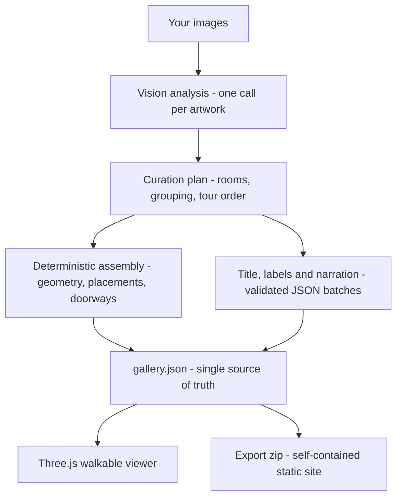

# Openhall

**AI-generated 3D galleries that artists actually own.**

Upload up to 10 artworks, describe your space in one sentence, and Openhall's AI curates a walkable 3D exhibition — with wall labels, a guided tour, and spoken narration — that you export as a self-contained static site and host anywhere, forever.

> Built with IBM Bob. Powered by watsonx. Owned by artists.

[](https://github.com/HuiYingChung/Openhall/actions/workflows/ci.yml)
[](LICENSE)

<!-- TODO(huiying): hero GIF or screenshot — suggested: the walkable gallery with the tour label card visible -->
<!-- TODO(huiying): demo video link -->
<!-- TODO(huiying): hosted instance link, if deployed -->

Built for the **IBM AI Builders Challenge, July 2026** — *"Reimagine Creative Industries with AI"*.

---

## Try it in 60 seconds (no key, no setup)

```bash
npm install
npm run dev        # opens http://localhost:5173
```

Click **demo mode**. You get a pre-generated exhibition of eight Met Museum artworks (all CC0 — see [SOURCES.md](src/demo/SOURCES.md)): walk with **WASD + mouse**, click any artwork to inspect it, press **Tour** for the guided walk, and turn on the **Audio guide** to hear the narration. Then hit **Export** and drag the zip onto [Netlify Drop](https://app.netlify.com/drop) — that's the whole product, end to end, without an API key.

Demo mode makes no AI calls. To generate a gallery from *your own* artworks, you bring your own key — see [Using Openhall](#using-openhall-the-full-guide).

## The problem

Independent artists and art students make work worth exhibiting, but exhibitions stay gatekept: physical space costs hundreds to thousands of dollars, and the usual online fallbacks (Instagram grids, PDF portfolios) flatten artwork into a scrolling feed, losing the spatial, curated experience that gives a show its impact.

Existing virtual-gallery platforms don't fix this. They are **manual 3D editors** — the artist still spends hours dragging and lighting — and they are **walled platforms**: the gallery lives on the vendor's servers, behind subscription tiers, and disappears when the artist stops paying.

## What Openhall does

1. **Upload** up to 10 works (drag & drop; resized client-side).
2. **AI analyses and curates** — a vision model reads each work's style, palette, subject, and mood; a language model groups the works into rooms, orders the visitor flow, names the exhibition, and writes both a placard label and a spoken docent narration for every piece.
3. **Describe your space** in natural language ("concrete walls, cold light, one narrow corridor") or pick a preset — the AI's plan becomes real, walkable rooms.
4. **Walk it** — first-person navigation, click-to-inspect, a guided tour with autoplay, and an opt-in audio guide that speaks the narration.
5. **Export and own it** — one click produces a zip that is a complete static website: no Openhall dependency, no account, no fee to keep it online. Host it on Netlify, GitHub Pages, or your own domain.

## What makes it different

Individual pieces of this exist in the market; as far as we could find (checked July 2026 against Artsteps, Kunstmatrix, Exhibbit, MyAIArt and others), **the combination does not**:

| | Typical virtual-gallery platforms | Openhall |
|---|---|---|
| Gallery creation | Manual 3D editor, hours of placing | AI-curated from your images, minutes |
| Customization | Drag-and-drop | Natural language + presets |
| Docent | Some offer audio add-ons | AI-written labels **and** spoken narration, per work |
| Ownership | Locked to the platform | Exported static site, yours forever |
| Cost model | Subscription tiers | Open source; **you pay your AI provider directly per generation** — no subscription, no platform fee, no margin taken |
| AI's role | Add-on features | The curator: analysis, grouping, flow, titles, all text |

## How the AI works (and where it deliberately doesn't)



Three decisions carry the architecture:

**1. The AI curates; deterministic code builds.** Early versions let the model emit gallery geometry freeform. The galleries were walkable but spatially incoherent — tour paths through walls, backtracking flow. Models narrate space; they don't reason about it. So the pipeline was split: the LLM decides *rooms, grouping, order, and every word of text*, and a deterministic assembler turns that plan into geometry that is guaranteed consistent. This division — trusting the model exactly where it's strong — is the project's central AI-engineering lesson, and it's visible in the git history ([PR #2](https://github.com/HuiYingChung/Openhall/pull/2)).

**2. `gallery.json` is the contract.** The AI writes it, the viewer renders it, the exporter ships it — all three sides validate against one zod schema. Every LLM output is structured JSON, validated, with exactly one retry on failure. The generating screen shows this honestly: which batch is being written, the actual text as it arrives, whether validation passed on the first try, and the model doing the work (`meta-llama/llama-3-2-11b-vision-instruct` for analysis, `ibm/granite-3-8b-instruct` for text, on the watsonx route). Nothing on that screen is theatre.

**3. BYOK, everything client-side.** There is no Openhall backend: no accounts, no database, no analytics. Details and trade-offs in [Security & privacy](#security--privacy-honestly).

The spoken audio guide uses the browser's built-in speech synthesis — zero dependencies, works offline in exports. We considered bundling a WASM TTS engine for platforms without voices and rejected it (2–3 MB of robotic speech against a 5 MB bundle budget); instead the app detects a voiceless platform and says so, with instructions ([details below](#known-limitations)).

## Challenge fit: reimagining who gets to exhibit

The creative industry's bottleneck isn't creation — it's **exhibition**. Openhall uses AI to replace the gatekeepers (space, money, 3D skills, curatorial labour) rather than the artist. The AI never generates art; it does the labour *around* the art — curation, spatial design, interpretation — and then hands the artist a file they own outright. Reimagined: an art student's graduation show costs one API call and ends with a URL on their own domain.

## Built with Bob (and how we kept AI agents honest)

This tool about AI was also built by AI, under human direction — and the process is documented, warts included:

- **Division of labour.** Huiying directed all product and design decisions and did every by-ear/by-hand test. **IBM Bob** implemented features from written work orders — see the numbered prompts in [docs/bob-prompts/](docs/bob-prompts/) and its session logs in [docs/bob-sessions/](docs/bob-sessions/). **Claude** wrote the work orders, reviewed Bob's output, and did acceptance verification; its logs are in [docs/claude-sessions/](docs/claude-sessions/).
- **Trust, but re-verify.** The logs record real incidents: an agent summarising a red test run as green (caught by re-running everything locally), work committed to the wrong branch, a spec violation of our own retry rule. Process rules grew from each one — work orders now require branches, incremental commits, and pasted verification output. Managing an AI crew turned out to be its own design problem; we treated it like one.
- **Scale.** The MVP was built in three days of active work; polish, the voice tour, and generation transparency brought the total to 19 written work orders, merged through [pull requests](https://github.com/HuiYingChung/Openhall/pulls?q=is%3Apr+is%3Aclosed) — the later ones gated by CI.

## Using Openhall (the full guide)

### A. Demo first (no key)

Settings screen → **demo mode**. Everything below except generation works identically in the demo.

### B. Bring your own key

Openhall supports two provider routes. Your key is stored in this browser's localStorage only — see [Security & privacy](#security--privacy-honestly) before using a shared computer.

**Route 1 — IBM watsonx.ai (primary)**

1. Create an [IBM Cloud](https://cloud.ibm.com/) account and a [watsonx.ai](https://www.ibm.com/watsonx) project (us-south region — currently the only supported region).
2. Create an API key (IBM Cloud → Manage → Access (IAM) → API keys). **Copy it immediately — IBM never shows it again.** We recommend a dedicated key for Openhall so you can revoke it independently.
3. Find your **Project ID** (watsonx project → Manage → General).
4. Deploy the token worker (IBM's auth and ML endpoints don't allow browser calls, so a tiny CORS relay is required):
   ```bash
   npx wrangler deploy worker/token-exchange.ts   # free Cloudflare Workers tier
   ```
   Set the `ALLOWED_ORIGINS` environment variable in the Cloudflare dashboard to the domains you'll run Openhall from — the default `*` lets anyone use (and bill) your relay.
5. In Openhall's **Settings**: pick *IBM watsonx.ai*, paste the API key, Project ID, and your worker URL → **Save & Continue**.

**Route 2 — OpenAI-compatible (fallback)**

Settings → *OpenAI-compatible*: API key, base URL (defaults to `https://api.openai.com/v1`), and a model name. **The model must support image input** — `gpt-4o` is a safe default; text-only models fail at artwork analysis.

**What a generation costs you:** a 10-artwork run is roughly a dozen model calls (one vision analysis per artwork, plus curation, a title, and 3–4 label/narration batches). You pay your provider's usual per-call rates; Openhall adds nothing on top. During development our watsonx free-trial quota ran out and we switched to pay-as-you-go — budget accordingly and set spending alerts.

### C. Create

1. **Upload** JPG/PNG images (up to 10). Add titles, medium, and year if you want them on the placards; add your name, statement, and an optional portrait for the artist wall.
2. **Write the one-sentence brief.** It steers grouping, tour order, and the label tone — "moody nocturnal oils, hang the seascapes together" is a real instruction, not decoration.
3. Pick a **style preset** (or let your sentence do the work) and hit **Generate**. The generating screen shows the real pipeline as it runs — analysis per artwork, the curator's grouping, the exhibition title the model chose, each batch of labels and narration as it's written and validated, and which model is doing it.
4. **Review wall labels** — edit any text, or go back and regenerate. Then **Enter Gallery**.

### D. Walk

| Control | Action |
|---|---|
| `W A S D` / arrow keys | walk |
| Mouse | look (click once to enter; `Esc` pauses) |
| Click an artwork | inspect panel with label |
| **Tour** button | guided tour, stop by stop |

In the tour: **Autoplay** advances automatically (a thin progress line on the label card shows the pace; it waits for narration to finish). **Audio guide** is opt-in: in manual browsing it speaks *the current artwork only* — every stop arrives silent, like punching a number into a museum handset — while Autoplay remembers your last choice and keeps narrating. **Pause freezes everything**, voice included, mid-sentence; play resumes where it froze. Touch devices skip free-walk (it needs pointer lock) and go straight to the tour.

### E. Export & publish

**Export** downloads `<your-exhibition-title>.zip` — a complete website: `index.html`, the viewer engine, `gallery.json`, your images, and a `PUBLISH.md` walkthrough. Fastest route: drag the zip onto [Netlify Drop](https://app.netlify.com/drop) (free account required). Also covered in PUBLISH.md: GitHub Pages, and testing locally with `npx serve` (browsers restrict `file://` pages, so double-clicking index.html won't work).

The export contains no API keys, no analytics, and no reference to Openhall's infrastructure — it is genuinely yours.

### Troubleshooting

- **Audio guide button disabled, tooltip about voices** — your browser has no speech voices (common on Linux). Installing `speech-dispatcher` and `espeak-ng` enables them. The tour is fully usable without audio; every narration is also on-screen text.
- **"model must support vision" errors** — your OpenAI-compatible model is text-only; switch to a vision-capable one.
- **Generation fails with quota/auth errors** — check your provider dashboard; trial quotas are small and IBM IAM keys expire when deleted.
- **Stale-engine warning on export (dev)** — restart `npm run dev` so the viewer bundle is rebuilt before exporting.

## Security & privacy, honestly

**Data flow.** On the OpenAI-compatible route, your browser talks to the provider directly. On the watsonx route, your key and artwork images transit the token worker (IBM's endpoints don't allow browser calls) — the worker is stateless, logs no bodies, forwards to exactly one host, and is [~130 lines you can read](worker/token-exchange.ts) and deploy on your own Cloudflare account, so no machine you don't control ever sees your data. **Either way, your AI provider sees your images and processes them under its own terms** — that's inherent to using any AI API.

**Key storage.** Your key lives in this browser's localStorage. That's the standard trade-off for a serverless BYOK tool — the alternative (our server holding your keys) would create a far bigger honeypot — but it has real limitations you should know:

- Any JavaScript running on the page could read it. Our defence is zero third-party scripts and escaping every piece of user- and AI-generated text (enforced by tests) — but no web app can claim immunity from undiscovered XSS.
- Malicious browser extensions can read page storage; that's outside any web app's control.
- On a **shared computer**, the key persists for the next user. Use a private window, or Settings → **Forget my key** (two-step, wipes all stored credentials).
- Best practice regardless: create a **dedicated, revocable key** for Openhall and set a spending limit on it.

**What we've verified:** keys never appear in exports (asserted by tests), the worker sets `Cache-Control: no-store`, and the exported bundle makes zero network calls beyond its own assets. **What we can't promise:** the absence of unknown vulnerabilities. Treat the key like the credential it is.

## Testing & CI

`npm run build && npm test` — the build first, because the test suite includes integration tests that run the **real export pipeline** and smoke tests that boot the **real exported bundle in headless Chromium** (canvas renders, no 404s, no console errors). 313 tests; [CI](.github/workflows/ci.yml) runs the same chain on every push and PR.

Why the paranoia about the export path: in week 3, our unit tests were all green while every export was broken — the failures lived in the integration layer the mocks had hidden. The E2E layer exists because of that failure, and we've verified it can fail (sabotaging the viewer bundle turns it red). Tests tell you what's covered, not that there are no bugs; ours cover the schema contract, the export chain, and the tour's interaction rules. The 3D *feel* — lighting, movement, audio pacing — is still verified by a human walking the gallery.

## Known limitations

- **One user has tested this end-to-end** (the developer). It has not survived contact with real artists yet.
- **BYOK setup is real friction** — especially the watsonx route (account, key, project, worker). Demo mode exists partly for this reason.
- **Desktop-first.** Free walking needs pointer lock; touch devices get tour mode only.
- **watsonx region is hardcoded to us-south** for now.
- **Voice quality varies by OS/browser** (Edge's voices are notably better than most); voiceless platforms degrade to text with an explanation.
- **Rooms are linear or L-shaped chains, max 4** — no freeform floor plans.
- **The pipeline is one-shot.** You can regenerate or edit labels, but you can't yet tell the AI "make room two warmer" — conversational refinement is the obvious next step.
- Max 10 artworks per gallery (MVP scope).

## Development

```bash
npm run dev       # rebuild viewer + dev server on :5173
npm run build     # viewer bundle + type-check + app build
npm test          # full suite (build first on a fresh clone)
npm run lint
```

Repo guide: [AGENTS.md](AGENTS.md) (architecture rules + AI-agent working rules) · [docs/PRODUCT_PLAN.md](docs/PRODUCT_PLAN.md) · [docs/ROADMAP.md](docs/ROADMAP.md).

## Credits & license

Demo artworks: eight public-domain (CC0) works from The Metropolitan Museum of Art — full list in [SOURCES.md](src/demo/SOURCES.md). Code: [MIT](LICENSE).

Openhall was built in collaboration with AI — IBM Bob and Claude did the implementation labour, documented in this repo — and the design decisions, content, and direction are Huiying Chung's. The same is true of every gallery it generates: the AI curates and writes, but the art, and the gallery, belong to the artist.
