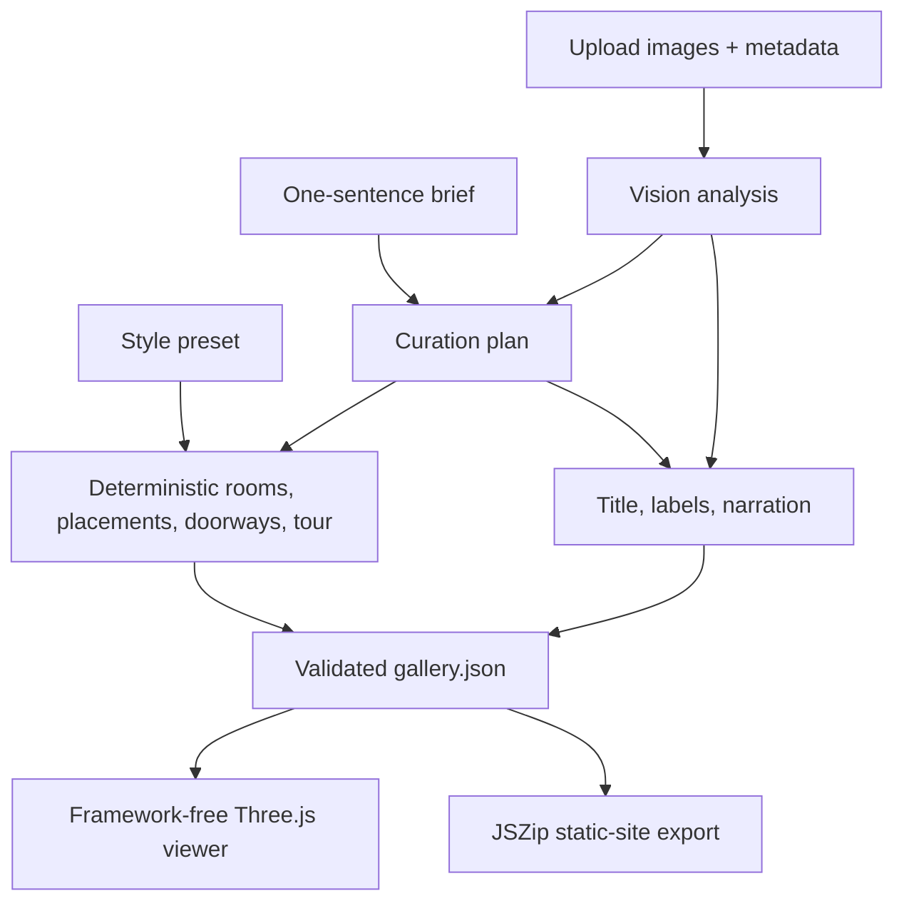

# Openhall — Product Plan

> AI-generated 3D galleries that artists actually own.
> [AI Builders Challenge with IBM Bob](https://aibuilderschallenge-bob.bemyapp.com/) — July 2026: "Reimagine Creative Industries with AI"

Status: current MVP specification, updated July 10, 2026. See [ROADMAP.md](ROADMAP.md) for verified completion state and submission work.

## 1. Problem statement

Independent artists and art students create work worth showing, but exhibiting it remains expensive, location-bound, and gatekept. Instagram grids, portfolio pages, and PDFs flatten a show into a feed. Existing virtual-gallery platforms provide spatial presentation, but commonly require manual 3D editing and keep the result inside the vendor's hosting and subscription model.

## 2. Target audience

| Tier | Who | Need |
|---|---|---|
| Primary | Art and design students | A credible graduation or portfolio show without gallery rent or 3D skills |
| Secondary | Independent and emerging artists | A shareable immersive showcase they can host themselves |
| Post-MVP | Collectives and educators | Group and classroom exhibitions |

## 3. Current solution

Openhall is an open-source BYOK web tool that turns up to 10 artwork images into a walkable exhibition and exports it as a self-contained static website.

1. **Upload and describe.** The artist supplies JPG, PNG, or WebP images, optional metadata, and a one-sentence curatorial brief.
2. **AI analyses and curates.** A vision model analyses each work. A language model chooses room count, grouping, wall assignments, within-room visitor order, title, labels, and narration.
3. **Deterministic code builds.** A selected style preset controls materials, lighting, and base dimensions. Code builds a linear room chain, places the works, routes the tour through doorways, and sanitizes placements.
4. **Visitors walk or tour.** Desktop visitors can use WASD and mouse-look; touch visitors enter guided tour mode. Labels and an opt-in browser speech-synthesis audio guide accompany the works.
5. **The artist exports and owns.** JSZip packages the viewer, `gallery.json`, artwork images, and publishing guide. The result has no runtime dependency on Openhall or an AI provider.

## 4. Differentiation

Openhall does not claim that every individual capability is unique. Commercial virtual galleries, AI audio guides, automatic procedural gallery generators, and exportable formats all exist. Its differentiation is the complete workflow in one open-source BYOK tool.

| | Typical hosted virtual-gallery platform | Openhall MVP |
|---|---|---|
| Creation | Manual editor or platform-specific automation | AI curation plus deterministic geometry |
| Input | Drag, place, and light works manually | Artwork images, one curatorial sentence, and a style preset |
| Interpretation | Manual labels or optional add-ons | AI-written title, labels, and narration |
| Ownership | Gallery remains on the platform | Static-site zip the artist can host anywhere |
| Cost | Subscription or platform tier | Artist pays provider usage directly; no Openhall fee or markup |

One-line pitch: **“An AI curator builds the show; the artist keeps the gallery.”**

## 5. MVP features

- **F1. Upload** — up to 10 JPG, PNG, or WebP images; drag-and-drop; client-side resize and compression.
- **F2. BYOK setup** — credentials remain in browser localStorage. IBM watsonx.ai is primary; OpenAI-compatible vision models are the fallback.
- **F3. AI analysis** — `meta/llama-3-2-11b-vision-instruct` analyses style, palette, subject, mood, and description into validated JSON.
- **F4. AI curation** — `ibm/granite-3-8b-instruct` chooses room count, grouping, wall assignments, and narrative order. Validation requires the order to move through rooms monotonically.
- **F5. Deterministic gallery assembly** — four visual presets define materials, lighting, proportions, and ceiling height. Room dimensions are deterministic; width increases by 1.5 metres for each artwork beyond the first three in a room. Rooms form a linear chain of at most four; transit waypoints route the camera through doorways.
- **F6. AI writing** — a plain-text title plus validated, editable wall labels and spoken narration. Structured failures retry once, then surface visibly.
- **F7. 3D walkthrough** — Three.js, WASD, Pointer Lock mouse-look, AABB collision, click-to-inspect, and camera dolly.
- **F8. Guided tour** — manual or autoplay navigation, touch fallback, and opt-in browser speech synthesis.
- **F9. Export** — a self-contained static-site zip with a `PUBLISH.md` guide; the real bundle is exercised in headless Chromium.
- **F10. Demo mode** — eight bundled CC0 artworks and a prebuilt, pre-authored gallery provide the visitor and export experience without an API key. Demo mode intentionally does not reproduce upload or generation.

### Explicitly out of MVP

Accounts, hosted persistence, multiplayer, VR/WebXR, video or imported 3D artworks, payments, managed AI usage, and one-click deployment APIs.

## 6. Architecture

The OpenAI-compatible route calls its provider from the browser. The watsonx browser route requires the user-configured stateless Cloudflare relay for IBM IAM token exchange and the watsonx ML request. There is no Openhall database or Openhall-operated backend.

### Key design decisions

- **`gallery.json` is the contract.** The generation pipeline produces it; the viewer renders it; the exporter ships it. The viewer and AI layers share the schema, not implementation code.
- **Creative decisions are AI; geometry is code.** Models choose curation and language. Deterministic code owns room dimensions, adjacency, coordinates, doorway routing, and placement sanity.
- **Procedural rooms, not imported architecture.** This keeps the export portable and below the 5 MB non-artwork budget.
- **Provider abstraction.** `WatsonxProvider` and `OpenAICompatProvider` implement the same `AIProvider` interface.
- **BYOK without an Openhall credential service.** Keys are stored locally and sent only to the selected provider or, for watsonx, the user-configured relay.

### Tech stack

- Vite + TypeScript strict mode
- Three.js viewer in vanilla TypeScript
- Zod schemas and structured-output validation
- IBM watsonx.ai: Llama vision analysis and Granite text generation
- JSZip client-side export
- Vitest plus real Chromium export smoke tests
- Cloudflare Worker relay for the watsonx browser route

## 7. IBM technology

- **IBM Bob** implemented core features from written work orders; BobShell prompts and session evidence are committed under `docs/bob-prompts/` and `docs/bob-sessions/`.
- **IBM watsonx.ai** is the primary runtime provider: Llama vision analysis and Granite curation/writing.
- **Narrative:** *Built with Bob. Powered by watsonx. Owned by artists.*

## 8. Sustainability

The open-source BYOK core remains free. Possible post-MVP services include managed hosting, custom domains, additional presets, and classroom tools, but none are required to use or host an exported gallery.

## 9. Risks and mitigations

| Risk | Current mitigation |
|---|---|
| Structured model output is malformed | Zod validation, one retry with the validation error, then a visible failure |
| Model-generated geometry is incoherent | The model no longer writes geometry; deterministic assembly and placement sanity do |
| watsonx browser setup is too difficult | Keyless demo mode, explicit worker guide, and OpenAI-compatible fallback |
| A public demo consumes the owner's AI budget | Demo mode is prebuilt; live generation remains BYOK |
| Export works in unit tests but fails in reality | Real zip creation, unzip, local static server, and Chromium smoke test |
| Submission is hard to evaluate quickly | Publish a hosted demo, screenshot/GIF, and short video before submission |
